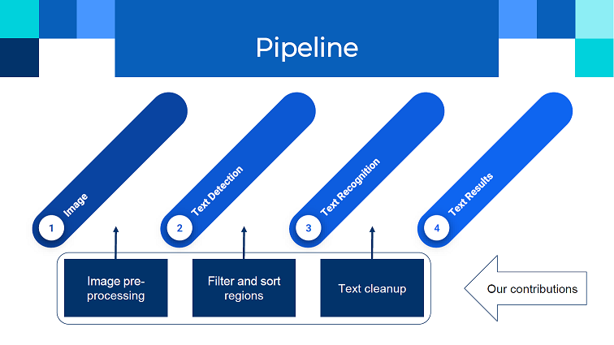
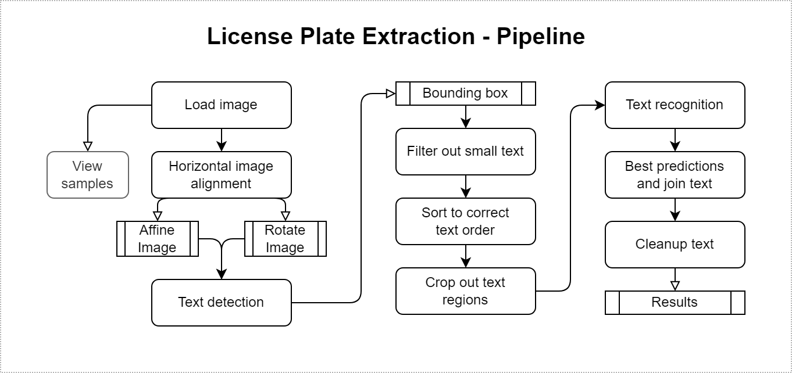
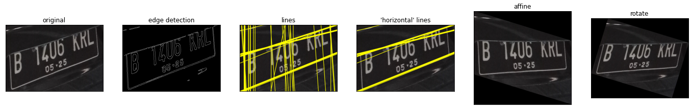
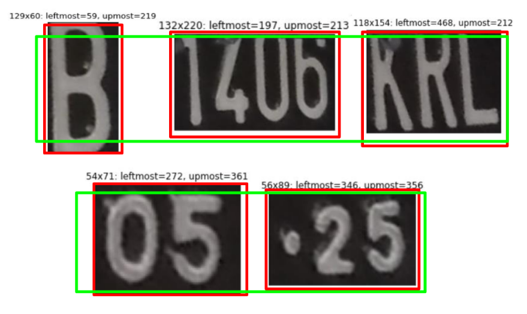
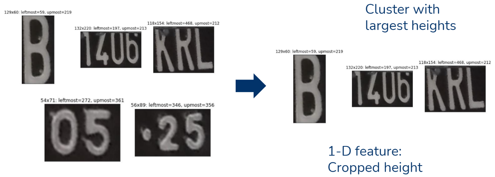

# License Plate Extraction

## Introduction
- This repository is part of the submission for Carro x AWS Hackathon 2022, in which we were awarded **Champion** with the prize of a **fully-funded trip to Seattle, USA** for the whole team.
- My contribution in this Hackathon is for this Computer Vision problem statement, where it attained the **highest score** among all problem statements.

<br>


## Repository Notes

- Original model repositories: [CRAFT](https://github.com/clovaai/CRAFT-pytorch), [DeepText](https://github.com/clovaai/deep-text-recognition-benchmark)
- Model checkpoints are available [here](https://github.com/leephilipx/license-plate-extraction/releases/tag/v1.0) for convenience, please unzip and use the directory tree below for reference.
- `Finale Pitch - Carro x AWS Hackathon 2022.pdf` contains our slides for the finale pitch, good visual illustrations are provided there too.
- `cv-ps1.ipynb` contains our main code for the techniques discussed below, alongside explanations.


```text
license-plate-extraction/
├─ CRAFT_pytorch/                                   # SOTA text detection model
├─ deep_text_recognition_benchmark/                 # Text recognition model
├─ results/                                         # Results directory
├─ cv-ps1.ipynb                                     # Main code with explanation
├─ Finale Pitch - Carro x AWS Hackathon 2022.pdf    # Finale slides
```

<br>


## Technical Contribution

Since the models used for text detection and text recognition were already SOTA, our contributions are mainly in the preprocessing and postprocessing portions as shown below. The full proposed pipeline for **license plate extraction** is also shown below.




<br>

### Pre-processing: Horizontal image alignment

Automatic image alignment with homography is hard to implement since rectangles may not be detected in the cropped image. As most of the vertical edges are mostly aligned already, we only seek to align the horizontal edges to see whether it helps the model recognize the text better.



Our procedure is detailed below:
- Obtain edge image using Canny edge detection
- Straight line detection using Hough transform
- Filter out 'horizontal' lines with normal angle $\frac{\pi}{3}<\theta<\frac{2\pi}{3}$
- Repeat line detection until good number of 'horizontal' lines
- Use median of thetas as best theta, this will be the dominant axis of the image
- Affine transform or rotate the image such that the dominant axis is horizontal

During the testing phase, we find that affine or rotation helps with the metrics significantly compared with using the original image.

<br>

### Pre-processing: Mean-shift Clustering

We use CRAFT for initial text detection and for cropping out text regions. Sorting using the leftmost x-coordinate is also done so that the text will be in the correct order at the end. Some license plates also have top to bottom text. To sort it, mean-shift clustering is used, the explanation is below.

**Vertical Position**  
- We also used mean-shift clustering to cluster text on the similar vertical level.  
- However, this assumes that the text is horizontally level.  
- Few cases in which our earlier alignment procedure fails resulted in wrong order of the texts.
  

**Height**  
- We use the height feature as a good indicator to predict whether the text is from the main license plate or elsewhere.  
- Mean-shift clustering is used with the bandwidth proportional to the image size, and the larger height cluster is kept.  
- The advantage is also that no labels are required since it is an unsupervised algorithm.
  

*Bandwidth Note:*  
Various bandwidths were tested including `min(int(img_diag/10),20)`, `int(img_diag/10)`. We find that `int(img_diag/20)` yields the best result. Image diagonal is calculated using $\sqrt{HW}$ for a $W$-by-$H$ image.

<br>

### Post-processing: Text Cleanup

We use DeepText for text recognition, then perform text cleaning using Regex since license plates only contains alphanumeric capital characters (depending on region).

<br>

### Results

We also perform ensembling across different text recognition methods (DeepText, EasyOCR) and different images from the horizontal image alignment output.  
The results reported are using the mean *Levenshtein distance* or *edit distance* across the entire dataset.

| Image \ Model | DeepText | EasyOCR | Ensemble: DeepText + EasyOCR |
|---|---|---|---|
| Original | 0.8505 | 0.7712 | 0.8415 |
| Affine | **0.9518** | 0.8595 | 0.9422 |
| Rotate | 0.9433 | 0.8403 | 0.9335 |
| Ensemble: Affine + Rotate | 0.9511 | 0.8620 | 0.9404 |

**Affine with DeepText** gives us the best Levenshtein distance score, so we use this as our final submission.  
We find that EasyOCR returns predictions with very high confidences, but not necessarily correct which penalises the final predictions.